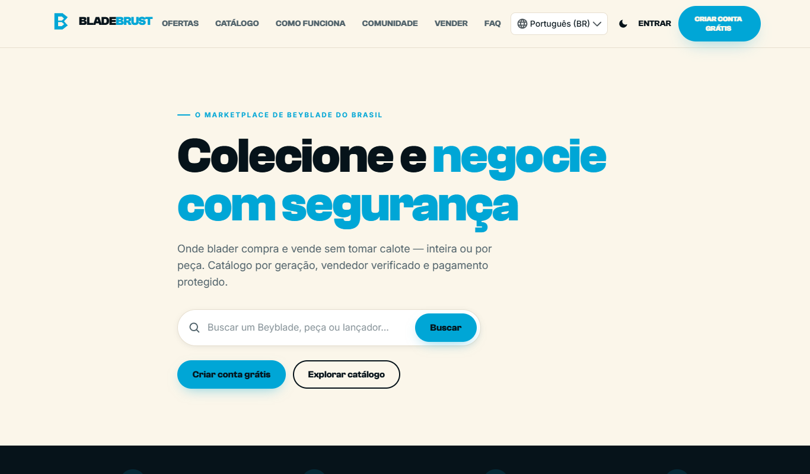
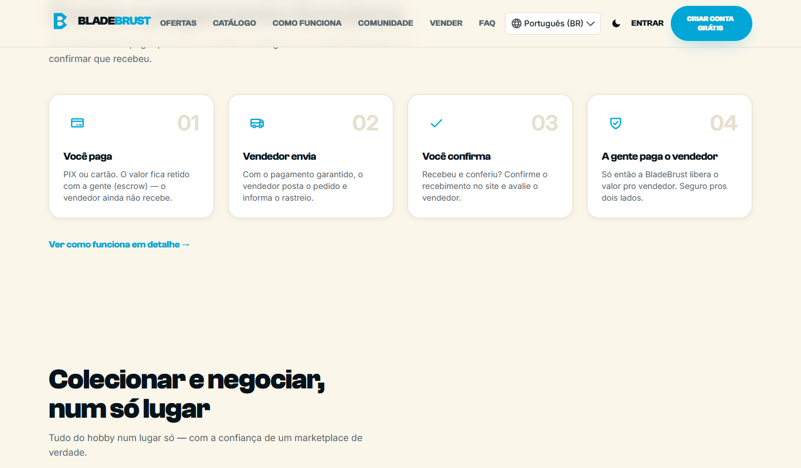
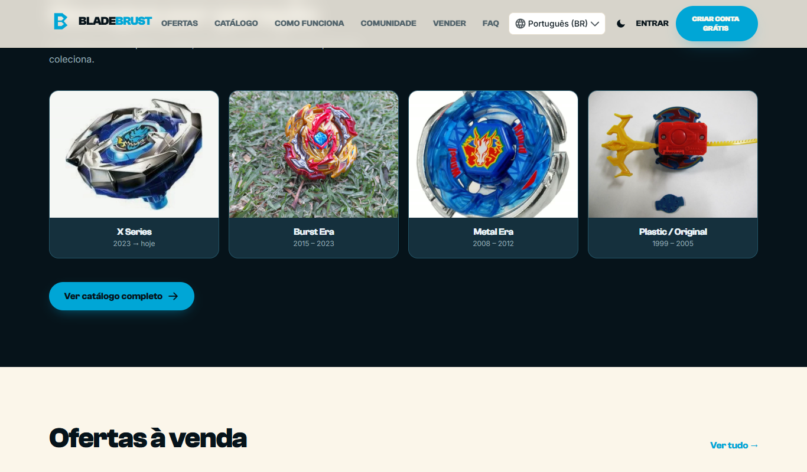
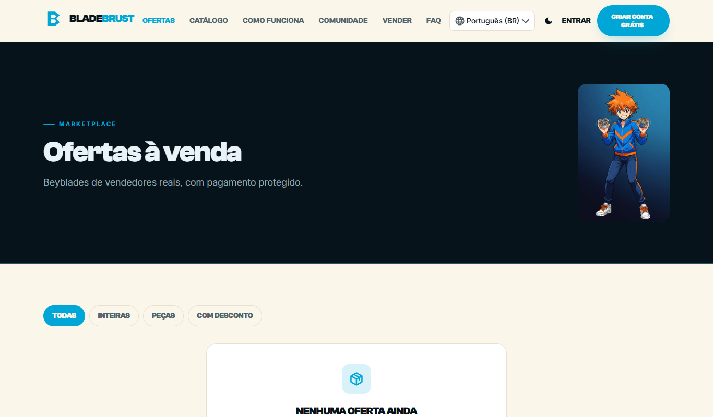
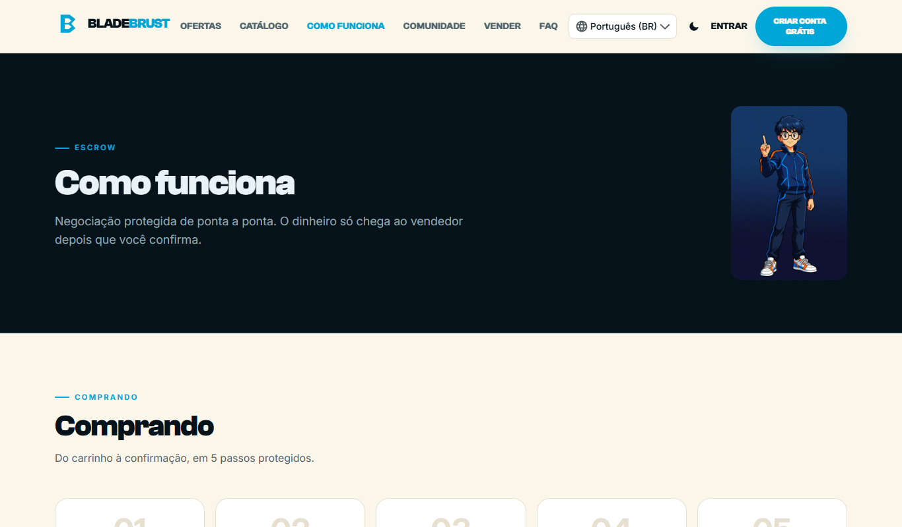

# 🔵 BladeBrust

**O marketplace de Beyblade do Brasil — colecionar e negociar com segurança.**
**The Beyblade marketplace of Brazil — collect and trade safely.**

&nbsp;

---

## 🇧🇷 Sobre

**BladeBrust** é um **marketplace + comunidade** para colecionadores de Beyblade. A ideia central: comprar e vender **com segurança** (sem calote, sem pagar por fora), a bey **inteira ou por peça**, com **pagamento protegido (escrow)** e vendedor verificado.

**Diferenciais**
- 🧩 **Venda por peça ou inteira** — o comprador acha e compra só a lâmina, o disco ou a ponta que precisa (metade do preço de uma bey inteira).
- 🔒 **Pagamento protegido (escrow)** — o dinheiro fica retido; o vendedor só recebe quando o comprador confirma o recebimento.
- ✅ **Vendedor verificado + reputação** real de compras anteriores.
- 🗂️ **Catálogo por geração** — X · Burst · Metal · Plastic/Original.
- 💬 **Perguntas públicas no anúncio** — tire dúvidas sem sair da plataforma (sem troca de contato).
- 🌐 **5 idiomas** (pt/en/es/fr/de), dark & light, PWA.

> 🔗 **Acesse:** **[baybladebrust-61393.web.app](https://baybladebrust-61393.web.app)**

## 🇺🇸 About

**BladeBrust** is a **marketplace + community** for Beyblade collectors. Core idea: buy and sell **safely** (no scams, no off-platform deals), the whole bey **or by part**, with **escrow-protected payment** and verified sellers.

**Highlights**
- 🧩 **Sell whole or by part** — buyers find and buy just the blade, disc or tip they need (half the price of a whole bey).
- 🔒 **Escrow-protected payment** — funds are held; the seller is paid only when the buyer confirms delivery.
- ✅ **Verified seller + real reputation** from past buyers.
- 🗂️ **Catalog by generation** — X · Burst · Metal · Plastic/Original.
- 💬 **Public Q&A on listings** — ask before buying, all on-platform.
- 🌐 **5 languages** (pt/en/es/fr/de), dark & light, PWA.

---

## 🖼️ Screenshots

| Como o pagamento funciona | Navegue por geração |
|---|---|
|  |  |

| Ofertas | Como funciona |
|---|---|
|  |  |

---

## 🛠️ Stack
Vite · React · TypeScript · TailwindCSS · Firebase (Auth · Firestore · Cloud Functions · Storage · Hosting) · i18next (5 idiomas) · PWA.

## 📌 Nota / Note
Este é o repositório **público de apresentação**. O código-fonte é privado. · This is the **public showcase** repo; the source code is private.

## ⚖️ Marca / Trademark
"Beyblade" e "Burst" são marcas registradas da **Takara Tomy / Hasbro**. **BladeBrust** é uma plataforma **independente**, não oficial e não afiliada. · "Beyblade" and "Burst" are trademarks of Takara Tomy / Hasbro. BladeBrust is an independent, unofficial and unaffiliated platform.

## 📫 Contato / Contact
[paulobatista19988@proton.me](mailto:paulobatista19988@proton.me)
