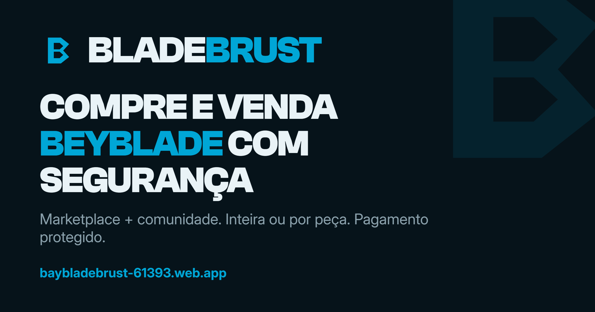
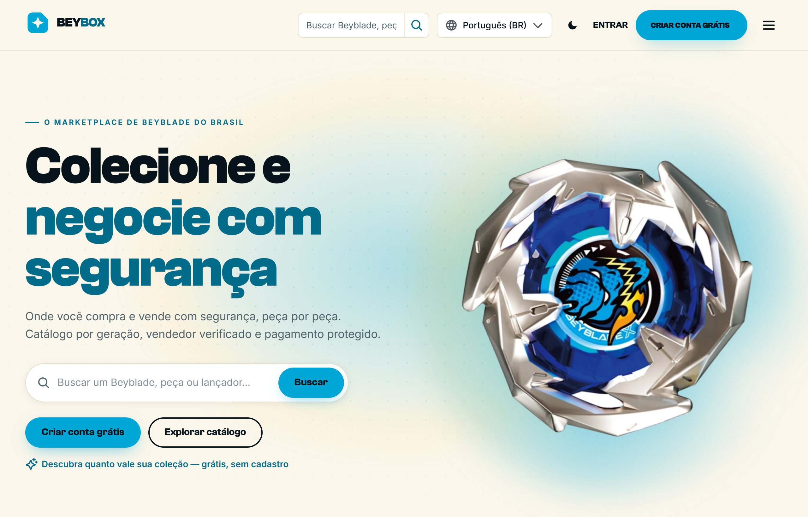
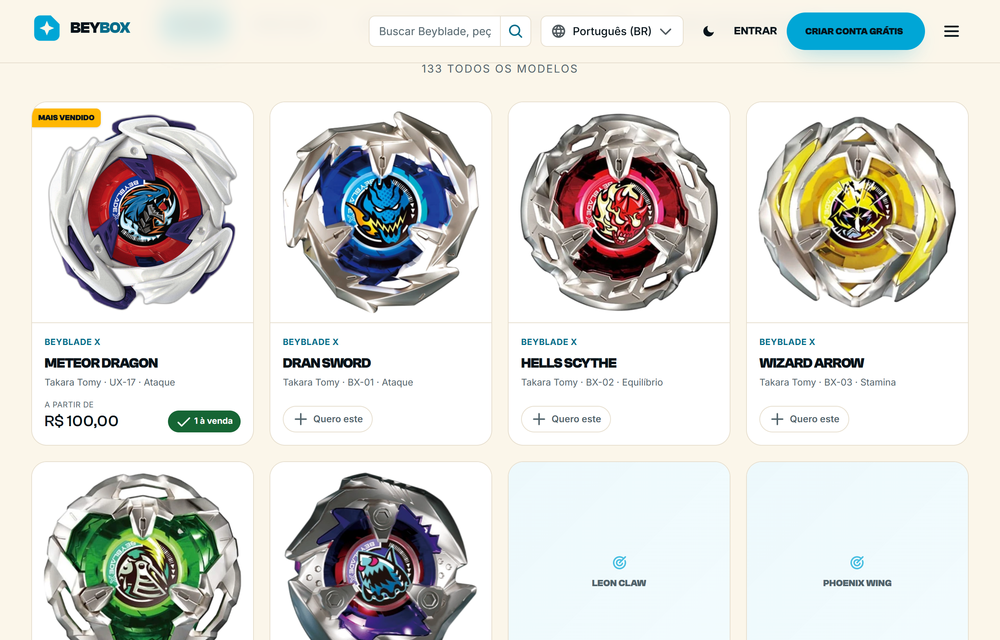
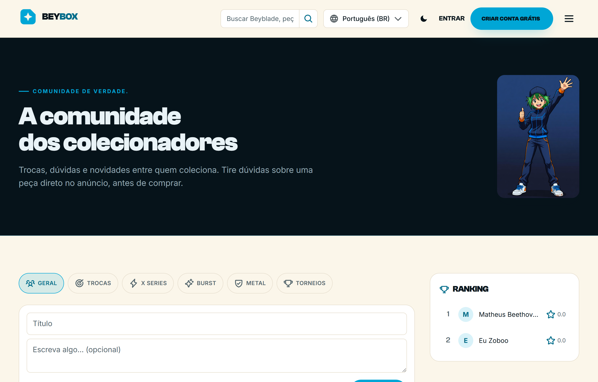
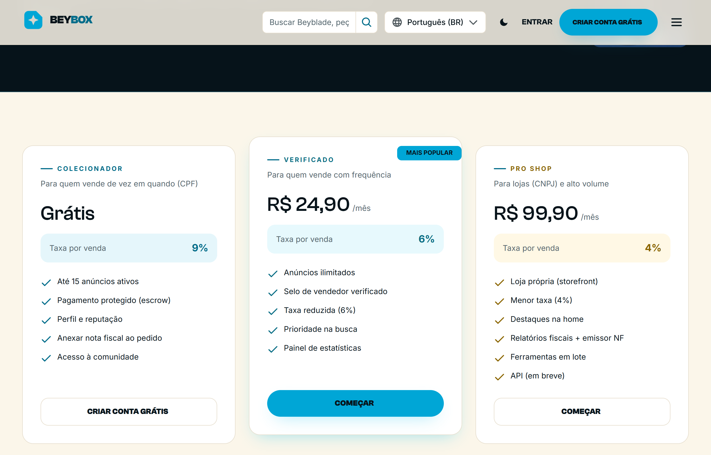

# BeyBox

**O marketplace de Beyblade do Brasil — colecione, compre e venda com segurança, inteira ou por peça.**

---

Onde você compra e vende com segurança, peça por peça. O BeyBox junta num só lugar o que a comunidade sempre fez espalhado em grupos e mensagens privadas — só que com **pagamento protegido**, catálogo organizado por geração e reputação de verdade.

Peça inteira ou solta. Vendedor verificado. O dinheiro só cai na mão de quem vendeu **depois** que você confirma que recebeu.

## ✨ Por que BeyBox

- **Compre com o dinheiro protegido (escrow).** O pagamento fica retido e só é liberado ao vendedor quando você confirma o recebimento. Deu ruim? Abre disputa e o valor volta.
- **Venda para quem realmente coleciona.** Anuncie sua peça — inteira ou por parte — e alcance um público que sabe o que está comprando.
- **Negocie inteira ou por peça.** Blade, ratchet, bit, lançador, arena — o catálogo é canônico e organizado por geração (Beyblade X, Beyblade Burst, Beyblade Metal Fight, Beyblade Bakuten Shoot).
- **Vendedor verificado + reputação real.** Selo de verificação e avaliações pós-compra que constroem confiança de verdade, não estrelinha de enfeite.
- **Vitrines e loja própria.** Vendedores Pro ganham storefront próprio para montar sua vitrine dentro da plataforma.
- **Comunidade viva.** Trocas, dúvidas e novidades entre quem coleciona — tire dúvida sobre uma peça direto no anúncio, antes de fechar.
- **PIX e cartão**, em português, com foco no colecionador brasileiro.
- **5 idiomas** (Português, English, Español, Français, Deutsch) — troque na hora.

## 🛡️ Como a compra fica segura

1. Você paga (PIX ou cartão) e o valor entra em **escrow** — retido, não vai direto pro vendedor.
2. O vendedor envia e marca como **enviado** (com rastreio).
3. Você recebe, confere e **confirma**.
4. Só então o dinheiro é **liberado** ao vendedor, já com a taxa do plano dele.
5. Problema no caminho? **Disputa** com evidências → mediação → estorno.

> Pagamento protegido do começo ao fim. Ninguém fica no prejuízo por confiar.

## 🖼️ A plataforma

  

  

## 💼 Planos de vendedor

Comece grátis. Quanto maior o plano, **menor a taxa** e mais vantagens.

| Plano | Preço | Taxa por venda | Pra quem é |
|---|---|---|---|
| **Colecionador** | Grátis | 9% | Vende de vez em quando (CPF) — até 15 anúncios ativos, pagamento protegido |
| **Verificado** ⭐ | R$ 24,90/mês | 6% | Vende com frequência — anúncios ilimitados + selo de verificado |
| **Pro Shop** | R$ 99,90/mês | 4% | Lojas (CNPJ) e alto volume — loja própria (storefront) + menor taxa |

## 🚀 Entra na arena

Criar conta é **grátis** e leva menos de um minuto. Comece a colecionar e negociar hoje:

➡️ **[baybladebrust-61393.web.app](https://baybladebrust-61393.web.app)**

## 🥷 Mascote

Todo projeto do estúdio tem o **ninja Codex** na cor da sua identidade — o mesmo mascote da casa, recolorido pro tema do **Bladebrust**.

 

## 👤 Sobre o desenvolvedor

**Paulo Adriel** é produtor de vídeo e desenvolvedor indie brasileiro. Construo o produto **e** a apresentação dele — código + identidade visual, motion e material de lançamento — do zero ao ar em 30 dias. Trabalho de forma aberta e escuto quem usa. Estúdio [**Paulocodex**](https://paulocodex.com).

 

---

📧 [contato@paulocodex.com](mailto:contato@paulocodex.com) &nbsp;·&nbsp; 🌐 [paulocodex.com](https://paulocodex.com) &nbsp;·&nbsp; 📸 [Instagram](https://instagram.com/paulodev.codex) &nbsp;·&nbsp; 💼 [LinkedIn](https://www.linkedin.com/in/paulo-adriel/) &nbsp;·&nbsp; 🐙 [github.com/Paulothedeveloper](https://github.com/Paulothedeveloper)

_Repositório de **apresentação pública** — o código-fonte é fechado. Nada de dado ou segredo aqui._

